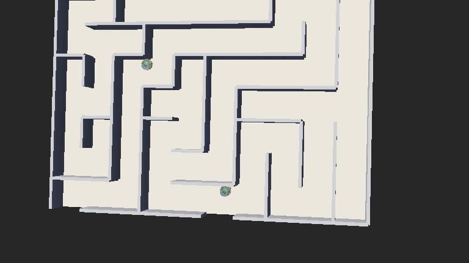
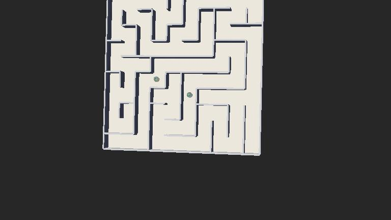
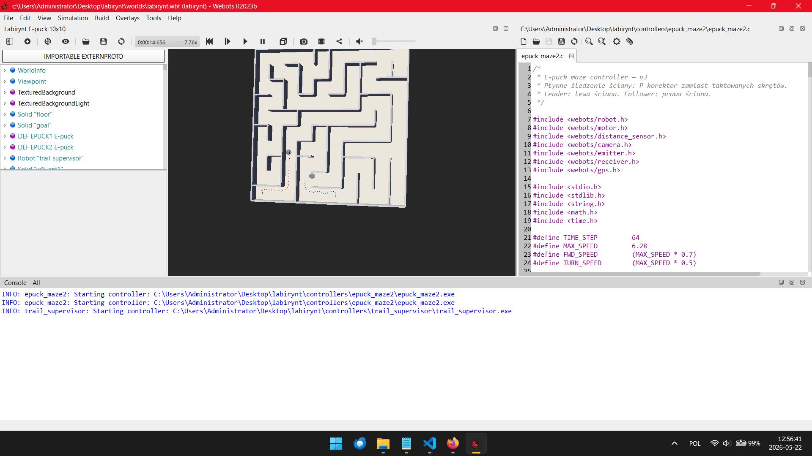

https://github.com/DmytroZavhorodnii/epuck-labirint
# epuck-labirint

Symulacja robotów mobilnych **e-puck** w środowisku **Webots R2023b** — algorytmy przechodzenia labiryntu.

---

##  Wizualizacja

### Labirynt 10×10



### Roboty w akcji



###  Demo (15 s)



---

##  Opis

Dwa roboty **e-puck** poruszają się po labiryncie 10×10 komórek, wygenerowanym algorytmem DFS (seed=42).

- **e-puck**  — lider, reguła lewej ręki
- **e-puck2** — follower, reguła prawej ręki

Roboty komunikują się przez emitter/receiver, wybierają lidera, omijają się nawzajem i wykrywają zielone wyjście za pomocą kamery.

###  Kluczowe cechy

| Cecha | Opis |
|-------|------|
| Algorytm | P-kontroler śledzenia ściany (płynna korekcja) |
| Kalibracja | Automatyczna (mediana 160 odczytów) |
| Komunikacja | Emitter/receiver, wybór lidera przez ROLL |
| Detekcja wyjścia | Kamera RGB — frakcja zielonych pikseli |
| Ślady | Supervisor rysuje kolorowe kropki na podłodze |
| Anti-stuck | GPS + licznik kroków → uturn awaryjny |

---

##  Struktura projektu

```
.
├── generate_world.py                  # Generowanie labiryntu (DFS)
├── worlds/
│   └── labirynt.wbt                   # Świat Webots
├── controllers/
│   ├── epuck_maze2/
│   │   ├── epuck_maze2.c              # Kontroler robotów (C)
│   │   └── Makefile
│   └── trail_supervisor/
│       └── trail_supervisor.c         # Supervisor śladów
├── images/                            # Zrzuty ekranu i demo
└── dokumentacja_v3.txt                # Pełna dokumentacja (PL)
```

---

##  Uruchomienie

1. Otwórz [Webots R2023b](https://cyberbotics.com/)
2. **File → Open World** → `worlds/labirynt.wbt`
3. Kliknij ▶ **Run**

---

##  Dokumentacja

Szczegółowy opis algorytmu, parametrów i napotkanych problemów znajduje się w pliku [`dokumentacja_v3.txt`](dokumentacja_v3.txt) oraz [`raport.txt`](raport.txt).
